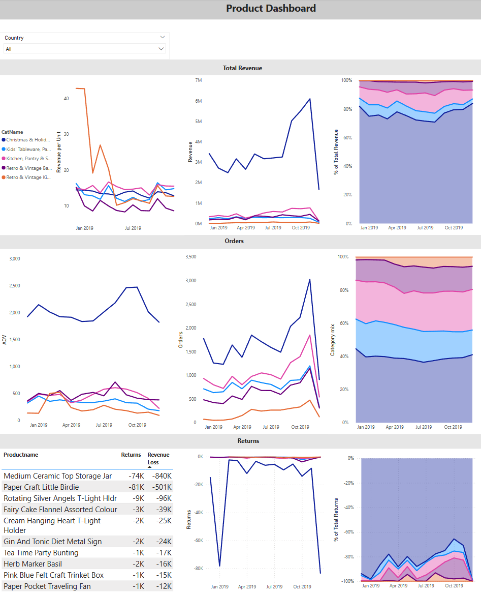
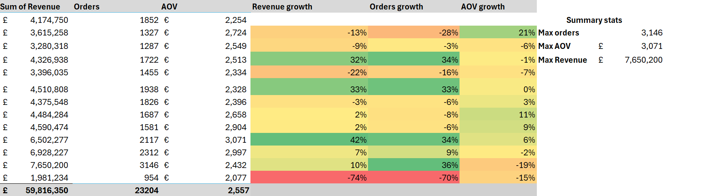
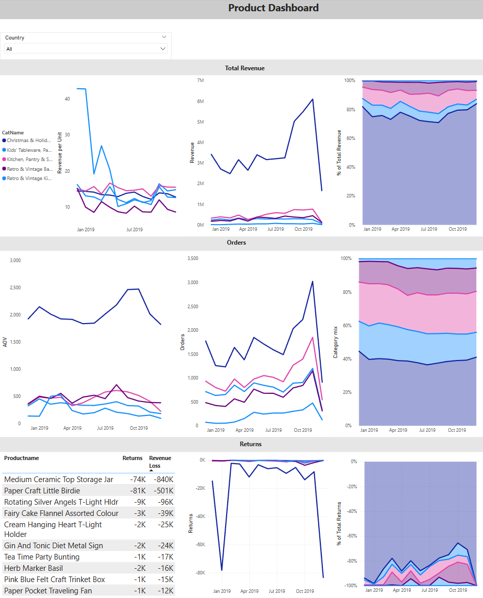

# London E-Commerce Analysis: 2018-2019

## Table of Contents

- [Project Background](#project-background)
- [Executive Summary](#executive-summary)
- [Sales Trend Analysis (Excel/SQL)](#sales-trend-analysis-excelsql)  
- [Product Performance (Excel/SQL/SQL)](#product-performance-excelsqlpython)  
- [Recommendations & Next Steps](#recommendations--next-steps)  
- [Assumptions and Caveats](#assumptions-and-caveats)

---

## Project Background

This is a sales transaction data set of UK-based e-commerce (online retail) for one year. This London-based shop has been selling Christmas & Holiday Merchandise, Kids' Tableware, Party Decor & Modern Accessories, Kitchen,Pantry & Select Home Goods, Retro & Vintage Bags, and Retro & Vintage Kids' Items through the website since 2007. Their customers come from all over the world and usually make direct purchases for themselves. There are also small businesses that buy in bulk and sell to other customers through retail outlet channels.

The company has significant amounts of data on its transactions, customers and  product offerings, that has been previously underutilized. This project thoroughly analyzes and synthesizes this data in order to uncover critical insights that will improve London's commercial success.

Insights and recommendations are provided on the following key areas:

- **Sales Trends Analysis**: Evaluation of historical sales patterns, both globally and by region, focusing on Revenue, Order Volume, and Average Order Value (AOV). Additional metrics were also considered to support deeper insights where relevant.

- **Product Performance**: An analysis of the business's various products and product catergories, understanding their impact on Revenue, orders and returns.

The data is organized across four tables: `Customers`, `Transactions`, `TransactionDetails`, `Products`,  and `Categories` with a total row count of 536,355.

The Excel file I used to to inspect and perform quality checks can be found here.

The SQL queries utilized to inspect and perform quality checks can be found here.
The SQL queries utilized to inspect and perform quality checks can be found here.

Here is the Entity Relationship Diagram after I normalized the raw data:

---

## Executive Summary

  ### Overview of findings
 
After sales peaked in november 2019, all key performance indicators have decreased month over month in December 2019: R**evenue declined 74%, Orders fell 70% and AOV decreased 15%** coinciding with a dramatic surge in product returns—reaching **84,000 units, a 434% year-over-year increase**. Notably, unlike the prior year's peak in January (which is typical for e-commerce retailers), returns peaked unusually early in December. This shift likely reflects a decline in consumer confidence driven by fulfillment delays and unmet delivery expectations during the critical holiday period. As a result, many customers may have reduced or canceled their orders altogether.

 

An interactive version of the above Tableau dashboard can be found [here](./powerbi/Product%20analysis(data).pbix).

---
## Sales Trend Analysis (Excel/SQL)

[ Back to Table of Contents](#table-of-contents)

My Excel worksheet can be found [here](./excel/Sales%20Transaction%20v.4a.xlsx)

 **Yearly Trends** 
- Revenue declined 53% year-over-year (YoY)
- Orders were down 48% YoY
- 37% decrease in Customers YoY
- 26% customer retention YoY only 279 customers in Dec 2018 returned in 2019, this could potentially be a great result since 26% falls within the average range for retail/e-commerce, and we acheived it during tumultous cirumstances
- Average Order Value (**AOV**) only decreased 8% YoY, indicating that the **quality/value of orders remained stable** even as the order quantity dropped by 48%
- **The company’s sales peaked in November 2019**,  **with** **3,146 orders**  **generating** **£7,650,200**  **in revenue**. This strong performance was driven by a **36% increase in orders containing lower-priced, high-volume products**
- Despite a dip in sales in December 2019, the business still recorded a 6% increase in revenue and a 19% rise in quantity sold from Q3 to Q4 2019

  

**Monthly trends**
  - The AOV decline of 19% in November 2019 can be largely attributed to **shift in product mix that resulted in a 15% decrease of the average price of a prodct sold that month**. This was compounded with a 8% decline items per order from last month

    
  - Revenue declined by 22% and order volume dropped 16% in April 2019. The primary driver of this downturn was a **290% surge in returns**, which rose sharply to a total of 13,700. Additionally, **product sales fell by 26%**, helping explain why the decline in revenue outpaced the drop in order quantity.

    
  - **The 74% drop in revenue and 70% decline in orders from November to December 2019 coincided with a surge in returns to 84,000 units—a 434% YoY increase**.
  - Unlike the previous year’s returns peak in January (which is [typical for e-commerce retailers](https://www.3p-logistics.co.uk/3pl-blog/how-to-plan-for-peak-season-returns)), December 2019 saw unusually high returns within the month itself.
 December 2019 saw unusually high returns within the month itself. This suggests a **loss of consumer confidence in product availability and fulfillment timing—especially if customers couldn’t get items in time for the holiday season**—likely caused by delays and unmet expectations. Consequently, many customers likely reduced or canceled orders.
     
 

 **Seasonality**
  -  Orders and revenue peaked in December 2018 and subseqently dip in January and February 2019 likely due to typical holiday seasonality, as the December shopping surge tapered off
  -   Return seasonality also appears evident in January, when consumers returned Christmas and holiday-related products. **Returns increased by an average of 404% from December 2018 to January 2019**
  -   The increase in orders and revenue in September 2019 can be attributed to a **53% rise in sales of the Christmas & Holiday Merchandise category**, which made up 74% of all  productsales that month. **This early spike suggests the impact of holiday or "Christmas creep"**, where seasonal shopping behavior begins well before Q4 as consumers prepare earlier for the holidays

    
 

 **Regional sales**  
  - In 2019 82% of our products were sold in the UK and 15% were international.
  - International sales declined 2% YoY
  - **82% of International sales are from Europe excluding the UK** in 2019
  - 16% of international sales are from APAC in 2019

You can find the excel worksheet I cleaned and used [here](./sql/sql%20analysis.sql).
You can find the SQL code for the dataset I created in MSSQL [here](./sql/sql%20analysis.sql).
    

>  Key tools: Pivot tables, aggregation, conditional formatting
> 
>  Key SQL techniques: aggregates, `INNER JOIN`, `CASE`, `NULLIF`,`ABS`,`ROUND`

---

## Product Performance (Excel/SQL/Python)

[ Back to Table of Contents](#table-of-contents)

An interactive version of the above Tableau dashboard can be found [here](./powerbi/Product%20analysis(data).pbix).

 **Revenue**  
 - Our top 50 most sold products only account for 4.5% of total revenue and product sales
 - 84% of our revenue came from the Christmas & Holiday Merchandise category at year end 2019 and **96% of revenue comes from our 3 best performing categories(Kitchen,Pantry & Select Home Goods, Christmas & Holiday Merchandise, Kids,Retro & Vintage Bags)**.
 - 95% of the changes in revenue for Christmas & Holiday Merchandise can be explained by how much of the category is sold (R² = 0.95) and 85% of the variation in revenue forKitchen,Pantry & Select Home Goods can be explained by changes in the quantity sold(R² = 0.85)
 -  Retro and Vintage kids items were the only cateory where revenue increased YoY(19% growth),
 - For sales made in December 2018, **24 products have only been bought 1 time since then, 85 products have been bought 5 times or less** in 2019
 - **The decline in AOV and revenue per unit(63%) for the Retro & Vintage Kids' Items category can be attributed to a shift in product mix toward higher-volume, lower-value items**. In November 2019, top-selling products included mass-market alphabet bags and accessories with significantly lower AOVs compared to the more premium, collectible items that led in December 2018. This product mix change diluted both AOV and unit revenue.
 - Despite this, **the category experienced a 7x revenue increase by November 2019 and 19% growth YoY**, suggesting that the business successfully scaled by targeting a broader customer base with more accessible price points. The trade-off was lower revenue per transaction, but substantially higher sales volume and market reach

 

**Orders**

- orders of Retro & Vintage kids items have grow 71% YoY, it went from 2% of all orders to 6%
- **AOV of Christmas & Holiday Merchandise 5.5x greater** than avg AOV of all other categories
-  Investigate AOV peaks for reto and vintage kids items
- Christmas & Holiday Merchandise have the most products bought per order(avg 176) and Retro & Vintage Kids' Items have the least(avg 21). This purchasing behavior is atypical for standard B2C consumer patterns, where individual or small-quantity purchases dominate. The elevated per-order quantities strongly indicate bulk purchasing consistent with B2B transactions.
- Using **Market basket analysis(MBA)**: I discoverd orders containing (Kids' Tableware & Party Decor, Retro & Vintage Kids' Items) have an 84% probability to also contain (Retro & Vintage Lunch Bags), this order accounts for 7% of all transaction.
- When customers buy Retro & Vintage Kids' Items they have a 81% probability to also buy Baking & Pantry Essentials, this accounts for 10% of all transactions

You can find the Python code for market basket analysis [here](./python/Market%20Basket%20Analysis%20-%20Copy.py).

- **55% of all transactions include Christmas & Holiday Merchandise and Kitchen,Pantry & Select Home Goods**
Christmas & Holiday Merchandise, Kids' Tableware, Party Decor & Modern Accessories, Kitchen,Pantry & Select Home Goods, Retro & Vintage Bags, and Retro & Vintage Kids' Items

**Returns**    
- **Christmas & Holiday Merchandise accounts for 40% of orders** across all years, but it represents **80% of returns** excluding December and January,when During these months this **category makes up 97% of all returns**.
- Investigate return peaks of non chrsitme items
-Product with most returns is **Medium Ceramic Top Storage Jar where a customer ordered £800k( 7% of Q1 2019 revenue)  worth of product and returned it on the same day** 
-The product Paper Craft Little Birdie has the largest single-transaction of **revenue and quantity (80,995 units, £1.0 M)** was purchased customer on 2019-12-09 and fully returned the same day,resulting in returns of over £500 K (≈ 3 % of Q4 revenue). **This still resulted in a net revenue of £500 K increase** as the value of the goods returned was only 50% of the price the goods were sold for.
- Returns for non-Christmas & Holiday Merchandise peak in spring and fall

  

    
 

**Return rate** 

- Average monthly return rate is **5.5%** 
- Across all years, Rotating Silver Angels T-Light Hlder had the highest return rate at 99.6% followed by Medium Ceramic Top Storage Jar(95.6%),Pantry Chopping Board (82%), Tea Time Party Bunting(55%).
      
- These products have return rates above **50%**, meaning they are returned more often than they are kept,indicating potential issues with product quality, accuracy of listings, or customer expectations.
  
You can find the SQL code for the dataset I created in MSSQL [here](./sql/sql%20analysis.sql).

You can find the Python code for creating the categories [here](./python/Cluster%20-%20Copy.py).

  

 

    

>  Key SQL techniques: CTEs, aggregates, nested queries, `INNER JOIN`, `CASE`, `NULLIF`,`ABS`,`ROUND`
 
> Key python libraries/techniques: pandas,mlxtend,apriori, association_rules, scikit learn,TfidfVectorizer,KMeans

---

## Recommendations & Next Steps

- **Create/improve category data**: Given the size of our product catalog(3,768), manually categorizing thousands of items is likely not feasible or scalable in the long term. To address this, I used k-means clustering to group products based on their similarities in attributes like name, . While this approach provides a useful starting point, it's an unsupervised method that doesn't account for context or business logic.For more accurate and business-aligned categorization, it may be worth exploring advanced predictive models—such as supervised classification algorithms which can learn from existing labeled data to make smarter categorization decisions. This model could deliver more consistent and relevant categories, especially as the product catalog continues to grow.

   
- **Investigate high return rate and worst selling products**:Review whether to discontinue products with return rates above 50% or consistently low sales performance, in order to streamline the product assortment and enhance profitability.

- **create customer loyalty program to improve retention**: Implementing a well-designed customer loyalty program can significantly enhance repeat purchase behavior and improve customer lifetime value. While our current customer retention rate is around average, a loyalty program would help differentiate our brand, especially in a competitive e-commerce environment.By offering points, discounts, or early access to new or seasonal products, we can incentivize repeat purchases and increase customer engagement. This is especially valuable for high-performing categories like Christmas & Holiday Décor, where customers may return annually,loyalty rewards can encourage them to choose us again over competitors. A loyalty program can also support help improve the weak AOV in  other categories 

- **Promotional Bundling Strategy**: Given the year-over-year decline in Average Order Value (AOV), bundling compatible products can effectively boost AOV. It also offers a convenient, one-stop solution for customers, especially in categories like party supplies and seasonal décor. Enhance convenience by creating themed bundles—for example, Kids' Tableware, Party Decor & Modern Accessories could include matching tableware, party favors, and decorations. Or, Kitchen, Pantry & Select Home Goods could offer curated sets like "Baking Starter Kits" or "Home Essentials." Promote seasonal bundles during peak periods (e.g., Christmas) to maximize revenue in the Christmas & Holiday merchandize category. Boost perceived value by pricing bundles to appear more cost-effective than buying items individually, encouraging higher spending per transaction.

   
- **Investigate refund ratio discrepancies**: Multiple return transactions show refund prices significantly lower or greater than original sale prices. This may result from data entry errors, incorrect transaction matching, or missing business rules. A focused data audit is recommended to match returns to correct sales, quantify anomalies, and clarify refund policies to ensure accurate reporting and protect data integrity.

- **Diversify to international markets especially USA**: Since Christmas & holiday merchandize makes up 81 - 84% of our revenue it is critcal that we continue to grow in the american market where Christmas shopping is highly commercialized and represents the largest opportunity for seasonal sales growth

 
---

## Assumptions and Caveats

**Data Cleaning**

- During the data cleaning process, I identified 9,956 duplicate entries in the original Excel dataset. To ensure the integrity and accuracy of the analysis, these duplicates were removed. As a result, the initial total of 536,350 entries was reduced to 526,394 entries. This step was crucial for maintaining the validity and reliability of the insights derived from the data. 

**Retund Rate**

- Some refunds do not have matching sales records in the dataset, these refunds are excluded from the refund rate calculations since they skew the rate above 100%

- Refunds for products below 20 orders were excluded to ensure adequate sample size

**Return Anomalies**

- During the analysis, several instances were identified where return transactions were recorded at **significantly lower or greater unit prices** than the original sales of the same product by the same customer.
- Similar discrepancies appear across multiple records, although the total number of such cases has not yet been quantified. These anomalies raise questions around:
  -Inconsistent or incorrect pricing during returns
  -Potential misalignment between return and original sale records
  -Missing business rules (e.g., restocking fees, return penalties) not captured in the data
  -These anomalous records were **not removed from the dataset** but were flagged as potentially unreliable for certain analyses, particularly those involving refund rate calculations.

  
**Categorization**
- The product categorization was performed using **k-means clustering** based on available product features such as descriptions and sales data.
- While this method groups similar items effectively, it **cannot perfectly categorize all products**, especially those with ambiguous or overlapping characteristics. This limitation is particularly evident in the "Christmas & Holiday Merchandise" category

**Caveat for "Holiday & Seasonal Merchandise**

- This category does include non-christmas/holdiay items whose primary unifying factor is their association with holiday and seasonal purchasing, rather than a strict functional type.

- Despite the varied item types,the findings that **97% of returns for products in this category occur in December and January, and orders for this category also peak during the same period**,strongly suggests these items are predominantly purchased within a Christmas/holiday context or the non-christas/holdiay are too irrelevant to change the overall trends.

**Author:**  
[Godwin Chacko](#)  
 godwinrejioutlook.com  
 [LinkedIn](https://www.linkedin.com/in/godwin-chacko-52b016241/)
 | [Portfolio](#)

