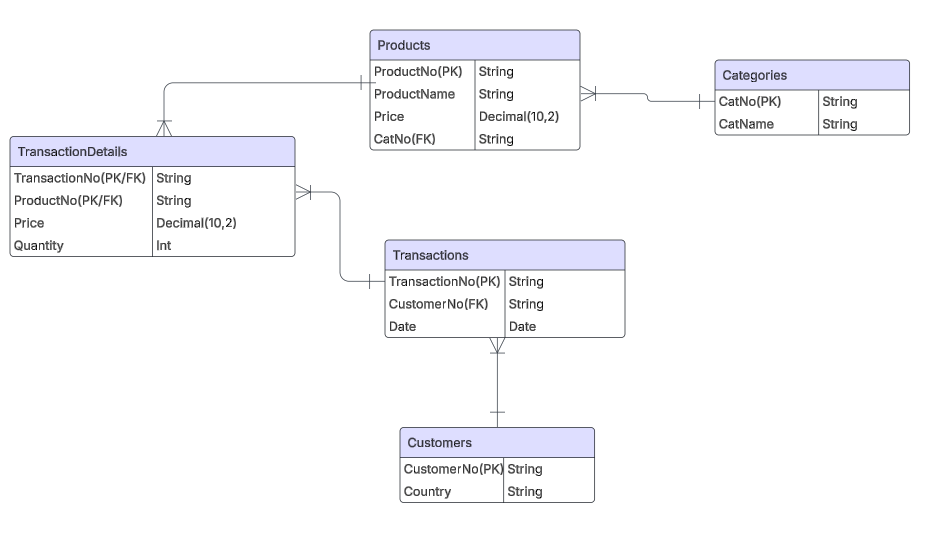

# London E-Commerce Analysis: 2018-2019

**Tableau dashboard showing tables, line graphs, and area charts for total sales, total orders, and average time to ship**

Analyzing Elist order trends from 2019–2022.  
👉 [View the interactive Tableau dashboard here](#)

## Table of Contents

- [Project Background](#project-background)
- [Executive Summary](#executive-summary)
- [Sales Trend Analysis (Excel/SQL)](#sales-trend-analysis-excelsql)  
- [Product Performance (Excel/SQL)](#product-performance-excelsql)  
- [Recommendations & Next Steps](#recommendations--next-steps)  
- [Assumptions and Caveats](#assumptions-and-caveats)

---

## Project Background

This is a sales transaction data set of UK-based e-commerce (online retail) for one year. This London-based shop has been selling gifts and homewares for adults and children through the website since 2007. Their customers come from all over the world and usually make direct purchases for themselves. There are also small businesses that buy in bulk and sell to other customers through retail outlet channels.

The company has significant amounts of data on its Transactions, customers and  product offerings, that has been previously underutilized. This project thoroughly analyzes and synthesizes this data in order to uncover critical insights that will improve London's commercial success.

Insights and recommendations are provided on the following key areas:

**Sales Trends Analysis**: Evaluation of historical sales patterns, both globally and by region, focusing on Revenue, Order Volume, and Average Order Value (AOV). Additional metrics such as product sales volume were also considered to support deeper insights where relevant.

**Product Performance**: An analysis of the business's various products and product catergories, understanding their impact on Revenue, orders and returns.

The data is organized across four tables: `Customers`, `Transactions`, `TransactionDetails`, `Products`,  and `Categories` with a total row count of 536,355.

Here is the Entity Relationship Diagram:

---

## Executive Summary

  ### Overview of findings
 
After sales peaked in november 2019, all key perofmroance indicators have decreased month over month in December 2019: Revenue declined 74%, Orders fell 70% and AOV decreased 15%. This decline can most likely be attributed to supply chain disutions in China that started in December 2019

---
## Sales Trend Analysis (Excel/SQL)

[ Back to Table of Contents](#table-of-contents)

Using Excel pivot tables and conditional formatting, I analyzed:

 **Yearly Trends**  
  - Revenue declined 53% YoY
  - Orders were down 48% YoY from 1852 to 954
    - The company's sales peaked in November 2019 with 3100 orders generating 7 mil in revenue. This perofrmance was fueled by a 36% increase of orders cointaining more cheap,high volume products.
  - 
  - Even though sales dipped in December 2019, the business still saw a 6% increase in revenue and a 19% rise in quantity sold from Q3 to Q4 2019.

  -   **Monthly trends**
  - The AOV decline of 19% in November 2019 can be largely attributed to shift in product mix resulint in 15% decrease of the average rpice of a prodct sold that month and 8% decline items per order
  - Revenue decreased 22% and orders were down 16% in April 2019. This  290% increase in returns to 13700 total retruns quantity was 

  - 
   **Seasonality**
  - S.

    
 

-  **Regional sales**  
  - In 2019 88% of our products were sold in the UK and 12% were international.
  - 

>  Key tools: Pivot tables, aggregation, conditional formatting

[Download the Excel workbook](#)

---

## Product Performance (Excel/SQL)

[ Back to Table of Contents](#table-of-contents)

Using Google BigQuery and SQL, I extracted insights such as:

 **Revenue**  
 - Our top 50 most sold products only account for 4.5% of total revenue and product sales
  - 

-  **Orders**  
  - Desktop led to 2,487 new customers; tablet purchases had highest AOV

  - 
  **AOV*  
  - Avg. 51 days from account creation to first purchase
  - 

  
 **Returns**  
  - Across all years, Macbook Airs had the highest refund rate at 4.2% followed by ThinkPads (3.8%) and iPhones (3.5%).

>  Key SQL techniques: CTEs, window functions, `QUALIFY`, `CASE`, `JOIN`

[View SQL queries](#)

---

## Recommendations & Next Steps

1. **Expand Loyalty Program**  
   Focus on customer retention via email campaigns and member-only promotions.
2. **Grow High-Value Categories**  
   Add more computer hardware products to the catalog.
3. **Track Financial KPIs**  
   Include CAC and COGS to assess net profit and LTV.
4. **Resolve Shipping Delays**  
   Investigate fulfillment processes for iPhones and Bose products.

---

## Assumptions and Caveats

**Data cleaning**

During the data cleaning process, I identified 9,956 duplicate entries in the original Excel dataset. To ensure the integrity and accuracy of the analysis, these duplicates were removed. As a result, the initial total of 536,350 entries was reduced to 526,394 entries. This step was crucial for maintaining the validity and reliability of the insights derived from the data. 

**Refund rate**
Some refunds do not have matching sales records in the dataset, these refunds are excluded from the refund rate calculations since they skew the rate above 100%

Refunds for products below 20 orders were excluded to ensure adequate sample size

---

**Author:**  
[Godwin Chacko](#)  
 godwinrejioutlook.com  
 [LinkedIn](#) | [Portfolio](#)

